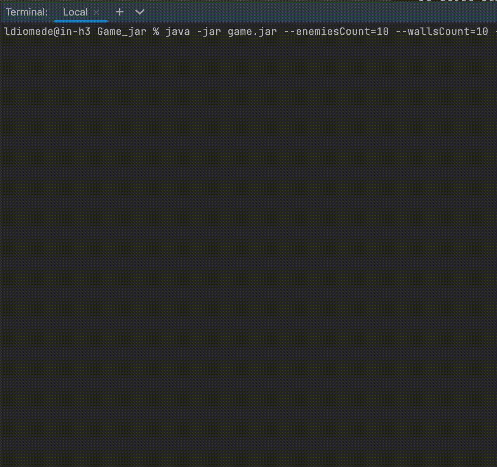

# Console Game

Игра, в которой игрок убегает от объектов искусственного интеллекта по квадратному полю.
Программа генерирует случайную карту с препятствиями. И игрок, и его враги располагаются на карте случайным образом. Каждый элемент карты иметь определенный цвет.

Обозначения : 
o- положение игрока (пользователя программы) на карте. 
#- препятствие 
x- противник (искусственный интеллект) 
O- целевая точка, до которой игрок должен добраться до того, как враги доберутся до игрока. Игрок считается достигшим целевой клетки, если он наступил на ее позицию.

Правила игры :

Каждый участник (игрок и враги) может сделать один ход. Затем наступает очередь другого участника. Противник считается достигшим игрока, если он может наступить на позицию игрока, сделав текущий ход.
Доступные направления движения: влево A, вправо D, вниз S и вверх W.
Если противник не может двигаться вперед (вокруг него есть препятствия или другие враги, или достигнут край карты), противник пропускает ход.
Целевая точка является препятствием для врага.
Если игрок не может двигаться вперед (окружен препятствиями, врагами или достиг края карты), игрок проигрывает игру.
Игрок проигрывает, если противник находит их до того, как они достигают целевой точки.
Игрок начинает игру первым.

Для запуска программы введите:

java -jar game.jar --enemiesCount=10 --wallsCount=10 --size=20 --profile=production

